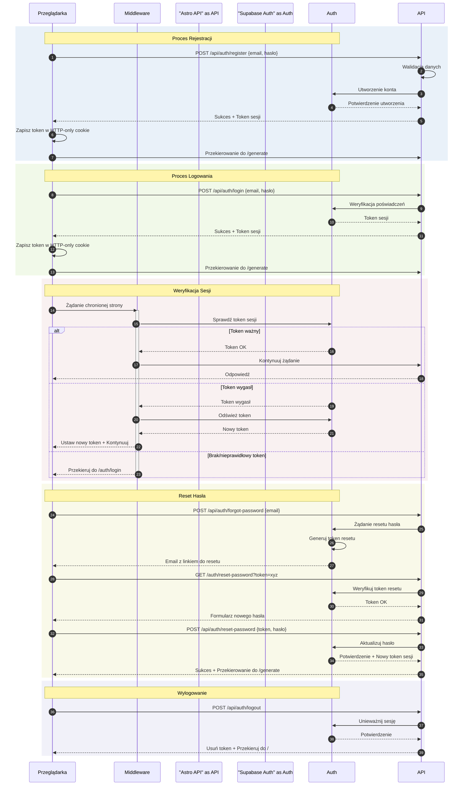

# Diagram przepływu autentykacji

Ten diagram przedstawia kompletny przepływ autentykacji w aplikacji, uwzględniając wszystkie kluczowe procesy: rejestrację, logowanie, weryfikację sesji, reset hasła oraz wylogowanie.

## Analiza procesu autentykacji

### 1. Zidentyfikowane przepływy autentykacji

- Rejestracja nowego użytkownika (US-001)
- Logowanie istniejącego użytkownika (US-002)
- Wylogowanie użytkownika (US-003)
- Proces resetowania hasła

### 2. Główni aktorzy

- Przeglądarka (interfejs użytkownika)
- Middleware Astro
- Endpointy API Astro
- Supabase Auth
- Baza danych

### 3. Procesy weryfikacji i odświeżania tokenów

- Zarządzanie tokenami przez Supabase
- Middleware wstrzykujący klienta Supabase
- Przechowywanie sesji w ciasteczkach HTTP-only
- Automatyczne odświeżanie tokenów

### 4. Kroki autentykacji

#### a) Rejestracja

- Walidacja formularza rejestracji
- Utworzenie konta w Supabase Auth
- Automatyczne logowanie po rejestracji
- Przekierowanie do aplikacji

#### b) Logowanie

- Weryfikacja poświadczeń
- Generowanie tokenu sesji
- Przekierowanie do /generate

#### c) Reset hasła

- Żądanie resetu
- Wysyłka maila z linkiem
- Ustawienie nowego hasła
- Automatyczne logowanie

#### d) Zarządzanie sesją

- Weryfikacja sesji na chronionych ścieżkach
- Automatyczne odświeżanie tokenów
- Czyszczenie sesji przy wylogowaniu

## Diagram sekwencji

